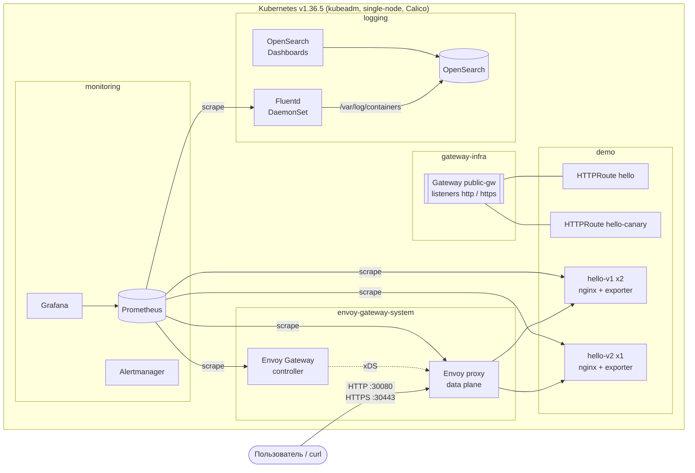

# Kubernetes + Gateway API + Observability

[](https://github.com/RostislavSerkov/k8s-gateway-observability/actions/workflows/ci.yaml)

Воспроизводимое развертывание "с нуля" на чистой **Ubuntu 24.04** одной командой:
**kubeadm**-кластер → веб-приложение (nginx) → публикация через **Kubernetes Gateway API** (Envoy Gateway) →
метрики в **Prometheus** → логи через **Fluentd** в **OpenSearch**.

```bash
git clone https://github.com/RostislavSerkov/k8s-gateway-observability.git
cd k8s-gateway-observability
make deploy     # ~15-20 минут на чистой VM: хост, kubeadm, Calico, все компоненты
make verify     # автоматическая проверка Gateway API, Prometheus и логирования
```

Каждый push в `main` прогоняет в GitHub Actions полный e2e-сценарий на чистом раннере Ubuntu 24.04:
`make deploy` → `make verify` → повторный `make deploy` (проверка идемпотентности) → `make verify`.

---

## Содержание

1. [Архитектура](#1-архитектура)
2. [Технологии и версии](#2-технологии-и-версии)
3. [Требования к среде](#3-требования-к-среде)
4. [Развертывание](#4-развертывание)
5. [Проверка приложения и Gateway API](#5-проверка-приложения-и-gateway-api)
6. [Проверка мониторинга](#6-проверка-мониторинга)
7. [Проверка логирования](#7-проверка-логирования)
8. [Дополнительные возможности](#8-дополнительные-возможности)
9. [Структура репозитория](#9-структура-репозитория)
10. [Известные ограничения](#10-известные-ограничения)

---

## 1. Архитектура



**Поток запроса.** Клиент обращается на NodePort ноды (30080/30443) → Envoy (data plane, управляется Envoy Gateway)
→ правило `HTTPRoute` → `Service` нужной версии приложения → под nginx. Ответ однозначно проверяем: `Hello World!`.

**Метрики.** Prometheus (kube-prometheus-stack) собирает: nginx-prometheus-exporter (sidecar в подах приложения),
Envoy data plane (HTTP RPS, коды ответа, latency), Envoy Gateway controller, Fluentd, а также всю инфраструктуру
кластера: node-exporter, kube-state-metrics, kubelet/cAdvisor, apiserver, etcd, scheduler, controller-manager, CoreDNS.

**Логи.** nginx пишет access-лог в stdout (JSON), error-лог в stderr. containerd сохраняет их в `/var/log/containers`.
Fluentd (DaemonSet) читает файлы, обогащает метаданными Kubernetes, разбирает JSON в поля и отправляет в OpenSearch
(индексы `k8s-logs-YYYY.MM.DD`). Просмотр: OpenSearch Dashboards или API OpenSearch.

**Публикация UI.** Grafana, Prometheus и OpenSearch Dashboards опубликованы через тот же Gateway
(маршрутизация по hostname), Prometheus и Dashboards закрыты Basic Auth (Envoy Gateway `SecurityPolicy`).

**Ресурсы Gateway API:**

| Ресурс | Namespace | Назначение |
|---|---|---|
| `GatewayClass envoy` | cluster | контроллер `gateway.envoyproxy.io/gatewayclass-controller`, параметры через `EnvoyProxy public-proxy` (NodePort, JSON access-лог, метрики) |
| `Gateway public-gw` | gateway-infra | listeners `http:80` и `https:443` (TLS terminate, `*.demo.local`); маршруты принимаются только из namespace с лейблом `gateway-access=true` |
| `HTTPRoute hello` | demo | `/` → hello-v1; `/v2` → hello-v2 (URLRewrite); заголовок `x-canary: true` → hello-v2; timeout 10s |
| `HTTPRoute hello-canary` | demo | `canary.demo.local`: weighted split 80% v1 / 20% v2 |
| `HTTPRoute grafana / prometheus` | monitoring | `grafana.demo.local`, `prometheus.demo.local` |
| `HTTPRoute opensearch-dashboards` | logging | `logs.demo.local` |
| `SecurityPolicy` (Envoy Gateway) | monitoring, logging | Basic Auth для Prometheus и OpenSearch Dashboards |
| `BackendTrafficPolicy` (Envoy Gateway) | demo | retry, circuit breaker, local rate limit для приложения |
| `ClientTrafficPolicy` (Envoy Gateway) | gateway-infra | таймауты клиентских соединений, X-Forwarded-For |

## 2. Технологии и версии

Все версии закреплены в одном файле [`versions.env`](versions.env) и в манифестах (теги образов).

| Компонент | Версия | Как устанавливается |
|---|---|---|
| ОС | Ubuntu 24.04 LTS | |
| **Kubernetes** (kubeadm, kubelet, kubectl) | **v1.36.5** | apt, официальный репозиторий `pkgs.k8s.io` |
| Container runtime | containerd (из Ubuntu 24.04, `SystemdCgroup=true`) | apt |
| CNI | Calico v3.32.2 (tigera-operator, VXLAN) | манифесты проекта Calico |
| **Gateway API** | CRD **v1.6.1** (поставляются с Envoy Gateway) | Helm |
| **Реализация Gateway API** | **Envoy Gateway v1.9.2** (Envoy Proxy 1.39) | Helm, `oci://docker.io/envoyproxy/gateway-helm` |
| Helm | v3.22.0 | бинарь с get.helm.sh, проверка sha256 |
| Приложение | nginx `nginxinc/nginx-unprivileged:1.29.8-alpine` | Kustomize |
| Экспортер приложения | `nginx/nginx-prometheus-exporter:1.5.3` | sidecar |
| **Мониторинг** | **kube-prometheus-stack 91.9.0** (Prometheus Operator, Prometheus, Alertmanager, Grafana, node-exporter, kube-state-metrics) | Helm |
| **Логирование** | **Fluentd v1.19.3** `fluent/fluentd-kubernetes-daemonset:v1.19.3-debian-opensearch-1.1` | Kustomize (DaemonSet) |
| Хранилище логов | OpenSearch 3.9.0 + OpenSearch Dashboards 3.9.0 (Apache-2.0) | Kustomize |
| Автоматизация | GNU Make, Bash, Helm, Kustomize (`kubectl apply -k`) | |
| CI | GitHub Actions: shellcheck, yamllint, kubeconform, e2e на kubeadm | |

Все компоненты open source, коммерческие сервисы и облачные LoadBalancer не используются.

## 3. Требования к среде

* Чистая VM или физическая машина с **Ubuntu 24.04 LTS** (x86_64).
* **4 vCPU, 8 ГБ RAM, 30 ГБ диска** (минимум 2 vCPU / 6 ГБ: работает, но медленнее).
* Пользователь с `sudo`, доступ в интернет (apt, pkgs.k8s.io, get.helm.sh, Docker Hub, quay.io, registry.k8s.io, GitHub).
* Свободные порты 6443, 30080, 30443; swap будет отключен скриптом.
* `git` и `make` (`sudo apt-get install -y git make`).

Решение протестировано на Ubuntu 24.04 LTS (GitHub Actions `ubuntu-24.04`, 4 vCPU / 16 ГБ), см. вкладку Actions.

## 4. Развертывание

### Одной командой (рекомендуется)

```bash
sudo apt-get update && sudo apt-get install -y git make
git clone https://github.com/RostislavSerkov/k8s-gateway-observability.git
cd k8s-gateway-observability
make deploy
```

`make deploy` (= `sudo ./scripts/deploy.sh`) выполняет по шагам:

| Шаг | Скрипт | Что делает |
|---|---|---|
| 0 | `scripts/00-host-prepare.sh` | проверка ОС; отключение swap; модули `overlay`, `br_netfilter`; sysctl; containerd с `SystemdCgroup=true`; kubeadm/kubelet/kubectl v1.36.5 (apt hold); Helm с проверкой sha256 |
| 1 | `scripts/01-cluster.sh` | `kubeadm init` по [шаблону конфигурации](deploy/kubeadm/kubeadm-config.yaml.tpl) (single-node, метрики control-plane доступны Prometheus); kubeconfig в `~/.kube/config`; Calico через tigera-operator |
| 2 | `scripts/02-platform.sh` | namespaces; генерация секретов (пароль Grafana, Basic Auth, self-signed TLS); Envoy Gateway (Helm); kube-prometheus-stack (Helm) |
| 3 | `scripts/03-apps.sh` | `kubectl apply -k deploy/manifests`: приложение, Gateway API, Fluentd, OpenSearch, ServiceMonitor/PodMonitor, алерты, дашборд; ожидание готовности |

В конце печатаются адреса UI и сгенерированные пароли (повторно: `make info`).

**Идемпотентность.** Повторный `make deploy` безопасен: `kubeadm init` пропускается, если кластер уже работает;
containerd перезапускается только при изменении конфига; Helm-релизы обновляются через `helm upgrade --install`;
ресурсы применяются декларативно `kubectl apply`; секреты создаются только при отсутствии. Это проверяется в CI
(второй прогон `make deploy` + `make verify`).

### Отдельные шаги

```bash
make help        # список команд
make cluster     # только хост + kubeadm + Calico
make platform    # только Envoy Gateway + kube-prometheus-stack
make apps        # только ресурсы решения (Kustomize)
make status      # ноды, Gateway, маршруты, поды
make destroy     # kubeadm reset (удалить кластер)
```

### В уже существующий кластер (kind, minikube, свой kubeadm)

Нужны `kubectl`, `helm`, `openssl`, `jq` и CNI с поддержкой NetworkPolicy:

```bash
export KUBECONFIG=~/.kube/config
make deploy-k8s
```

## 5. Проверка приложения и Gateway API

Автоматически: `make verify` (раздел 1 вывода). Вручную (на ноде кластера):

```bash
NODE_IP=$(kubectl get nodes -o jsonpath='{.items[0].status.addresses[?(@.type=="InternalIP")].address}')

curl -i http://$NODE_IP:30080/
# HTTP/1.1 200 OK
# x-app-version: v1
# x-route: default
# Hello World!
```

Ресурсы Gateway API и их статусы:

```bash
kubectl get gatewayclass,gateway -A          # PROGRAMMED=True
kubectl get httproute -A
kubectl -n demo describe httproute hello      # Accepted=True, ResolvedRefs=True
```

Расширенные возможности маршрутизации:

```bash
curl http://$NODE_IP:30080/v2/                          # path /v2 -> hello-v2: "Hello World! (v2 canary)"
curl -H 'x-canary: true' http://$NODE_IP:30080/         # header -> hello-v2
for i in $(seq 100); do curl -s -H 'Host: canary.demo.local' http://$NODE_IP:30080/; done | sort | uniq -c
#   ~80 Hello World!
#   ~20 Hello World! (v2 canary)
curl -k --resolve hello.demo.local:30443:$NODE_IP https://hello.demo.local:30443/   # HTTPS (TLS на Gateway)
curl -i http://$NODE_IP:30080/error                     # 500 для демонстрации метрик/алертов по 5xx
```

## 6. Проверка мониторинга

Автоматически: `make verify` (раздел 2: все targets `up` и PromQL-запросы с данными).

**Что собирается:**

| Источник | Как подключен | Примеры метрик |
|---|---|---|
| nginx (hello-v1/v2) | sidecar `nginx-prometheus-exporter`, `ServiceMonitor demo/hello` | `nginx_http_requests_total`, `nginx_connections_active`, `nginx_up` |
| Envoy data plane | `PodMonitor envoy-gateway-system/envoy-proxy` | `envoy_cluster_upstream_rq_total`, `envoy_cluster_upstream_rq_xx` (коды 2xx/4xx/5xx), `envoy_cluster_upstream_rq_time_bucket` (latency) |
| Envoy Gateway controller | `ServiceMonitor envoy-gateway` | `watchable_*`, `xds_*`, статусы ресурсов |
| Fluentd | `PodMonitor logging/fluentd` | `fluentd_output_status_emit_records`, `..._retry_count`, `..._buffer_queue_length` |
| Нода | node-exporter | CPU, RAM, диск, сеть |
| Kubernetes | kube-state-metrics, kubelet/cAdvisor, apiserver, etcd, scheduler, controller-manager, kube-proxy, CoreDNS | состояние объектов, CPU/RAM контейнеров, latency API |

Плюс recording rules (`demo:envoy_upstream_rq:rate1m`, `demo:envoy_upstream_rq_latency_ms:p95_1m`,
`demo:envoy_upstream_rq_5xx:ratio5m`, `demo:nginx_requests:rate1m`) и алерты (`HelloNoAvailableReplicas`,
`GatewayHigh5xxRatio`, `GatewayHighLatencyP95`, `FluentdOutputErrors` и др.), см.
[`prometheusrule.yaml`](deploy/manifests/monitoring/prometheusrule.yaml).

**Проверка через API** (без port-forward, через API-server proxy):

```bash
# Состояние целей
kubectl get --raw '/api/v1/namespaces/monitoring/services/kps-prometheus:9090/proxy/api/v1/query?query=up%7Bnamespace%3D%22demo%22%7D' | jq '.data.result[] | {job: .metric.job, pod: .metric.pod, up: .value[1]}'

# Запросы к приложению по версиям
kubectl get --raw '/api/v1/namespaces/monitoring/services/kps-prometheus:9090/proxy/api/v1/query?query=sum%20by%20(version)%20(nginx_http_requests_total)' | jq '.data.result'
```

**Через UI.** Добавьте на машине с браузером в `/etc/hosts` строку `<NODE_IP> grafana.demo.local prometheus.demo.local logs.demo.local`:

* Prometheus: `http://prometheus.demo.local:30080` (логин/пароль: `make info`) → Status → Targets; запрос
  `sum by (envoy_response_code_class) (rate(envoy_cluster_upstream_rq_xx{envoy_cluster_name=~"httproute/demo/.*"}[1m]))`.
* Grafana: `http://grafana.demo.local:30080` (`admin` / пароль из `make info`) → дашборд **Hello App & Gateway**:
  RPS и коды ответа через Gateway, p50/p95/p99 latency, распределение canary по версиям, CPU/RAM подов, конвейер логов.
  Плюс стандартные дашборды kube-prometheus-stack (ноды, поды, API server, etcd).

## 7. Проверка логирования

Автоматически: `make verify` (раздел 3): отправляет запрос с уникальной меткой `?probe=probe<timestamp>` и ждет,
пока соответствующая запись nginx (и Envoy) появится в OpenSearch.

**Что собирается:** логи контейнеров namespace `demo` (nginx: access-лог JSON из stdout и error-лог из stderr)
и access-логи Envoy (Gateway, JSON). Fluentd добавляет метаданные (`kubernetes.namespace_name`, `pod_name`,
`container_name`, labels), раскладывает JSON по полям `http.*` (`http.status`, `http.uri`, `http.request_time`, ...)
и проставляет `log_type`: `access` / `error`.
**Куда:** OpenSearch, индексы `k8s-logs-YYYY.MM.DD`. Конфигурация: [`fluent.conf`](deploy/manifests/logging/fluent.conf).

Вручную:

```bash
NODE_IP=$(kubectl get nodes -o jsonpath='{.items[0].status.addresses[?(@.type=="InternalIP")].address}')
curl -s "http://$NODE_IP:30080/?probe=expert42"
sleep 5
kubectl get --raw '/api/v1/namespaces/logging/services/opensearch:9200/proxy/k8s-logs-*/_search?q=expert42' \
  | jq '.hits.hits[]._source | {ts: .["@timestamp"], ns: .kubernetes.namespace_name, pod: .kubernetes.pod_name, type: .log_type, status: .http.status, uri: (.http.uri // .http.path)}'
```

Ожидаемый результат: две записи для одного запроса: от пода `hello-v1-*` (nginx) и от пода `envoy-*` (Gateway).

UI: `http://logs.demo.local:30080` (Basic Auth, см. `make info`) → Discover → index pattern `k8s-logs-*`
(создается автоматически), поиск `http.uri:*expert42*` или `kubernetes.namespace_name:demo and http.status:500`.

## 8. Дополнительные возможности

| Улучшение | Реализация | Как проверить |
|---|---|---|
| Маршрутизация по path | `HTTPRoute hello`, правило `/v2` + `URLRewrite ReplacePrefixMatch` | `curl $NODE_IP:30080/v2/` |
| Маршрутизация по header | правило с `headers: x-canary: "true"` | `curl -H 'x-canary: true' ...` |
| Маршрутизация по hostname, несколько маршрутов и backend | 5 HTTPRoute в 3 namespace, `canary/grafana/prometheus/logs.demo.local` | `kubectl get httproute -A` |
| Traffic splitting (canary 80/20) | `HTTPRoute hello-canary`, `backendRefs.weight` | цикл curl из раздела 5; панель canary в Grafana |
| TLS | listener `https:443`, self-signed wildcard-сертификат генерируется при деплое | `curl -k --resolve ...:30443` |
| Модель ролей Gateway API | Gateway в `gateway-infra`, маршруты в namespace приложений, `allowedRoutes` по лейблу | маршрут из namespace без лейбла не принимается |
| Basic Auth на Gateway | Envoy Gateway `SecurityPolicy` для Prometheus и OpenSearch Dashboards | `make verify`: 401 без пароля, 200 с паролем |
| Надежность трафика | `BackendTrafficPolicy`: retry (connect-failure, reset, 503), circuit breaker, local rate limit; `ClientTrafficPolicy`: таймауты; request timeout в HTTPRoute | `kubectl -n demo describe backendtrafficpolicy` |
| HTTP-метрики, коды, latency | метрики Envoy + nginx-exporter, recording rules | дашборд Grafana, PromQL из раздела 6 |
| CPU/RAM, инфраструктура | node-exporter, cAdvisor, kube-state-metrics, control-plane | стандартные дашборды Grafana |
| Алерты | `PrometheusRule`: недоступность, 5xx > 5%, p95 > 500 мс, ошибки Fluentd | Prometheus → Alerts |
| Дашборд | Grafana ConfigMap `grafana_dashboard=1` | Grafana → Hello App & Gateway |
| Централизованное хранение и поиск логов | OpenSearch + Dashboards, разбор JSON в поля, логи Envoy | раздел 7 |
| Мониторинг конвейера логов | метрики Fluentd в Prometheus, алерты | `fluentd_output_status_*` |
| CI/CD | GitHub Actions: shellcheck, yamllint, kubeconform (схемы K8s + CRD), e2e на kubeadm, проверка идемпотентности | вкладка Actions |
| Безопасность | NetworkPolicy (default-deny в `demo`, изоляция OpenSearch), Pod Security Admission `restricted`, non-root, read-only root FS, drop ALL capabilities, без automount токена, секреты генерируются при деплое | `kubectl get netpol -A`, `kubectl get ns --show-labels` |
| Надежность приложения | 2 реплики v1, PodDisruptionBudget, readiness/liveness probes, preStop для graceful shutdown, limits | `kubectl -n demo get pdb,deploy` |

## 9. Структура репозитория

```
├── Makefile                       # точка входа: make deploy / verify / info / destroy
├── versions.env                   # все версии компонентов
├── scripts/
│   ├── deploy.sh                  # полный сценарий (шаги 00-03)
│   ├── 00-host-prepare.sh         # Ubuntu: swap, sysctl, containerd, kubeadm, helm
│   ├── 01-cluster.sh              # kubeadm init + Calico
│   ├── 02-platform.sh             # секреты, Envoy Gateway, kube-prometheus-stack (Helm)
│   ├── 03-apps.sh                 # kubectl apply -k deploy/manifests + ожидание
│   ├── verify.sh                  # smoke-тесты всех компонентов
│   ├── info.sh                    # адреса и пароли
│   ├── destroy.sh                 # kubeadm reset
│   └── lib.sh                     # общие функции
├── deploy/
│   ├── kubeadm/kubeadm-config.yaml.tpl
│   ├── calico/installation.yaml
│   ├── helm/                      # values для Envoy Gateway и kube-prometheus-stack
│   └── manifests/                 # Kustomize
│       ├── namespaces.yaml
│       ├── app/                   # nginx v1/v2, Service, PDB, NetworkPolicy, ServiceMonitor
│       ├── gateway/               # EnvoyProxy, GatewayClass, Gateway, HTTPRoute, политики
│       ├── logging/               # Fluentd (DaemonSet, RBAC, fluent.conf), OpenSearch, Dashboards
│       └── monitoring/            # PodMonitor/ServiceMonitor, PrometheusRule, дашборд Grafana
└── .github/workflows/ci.yaml      # CI: lint + e2e на Ubuntu 24.04 с kubeadm
```

## 10. Известные ограничения

* **Single-node кластер.** Control-plane и нагрузка на одной ноде (taint снят). Для нескольких нод нужен
  `kubeadm join` и внешний балансировщик/MetalLB перед NodePort.
* **Внешний доступ через NodePort** (30080/30443): в "голом" kubeadm нет облачного LoadBalancer. В продакшене -
  MetalLB или аппаратный балансировщик.
* **Без постоянных томов.** В чистом kubeadm нет StorageClass по умолчанию, поэтому Prometheus и OpenSearch
  хранят данные в `emptyDir` (данные теряются при пересоздании пода). Для продакшена нужен CSI/local-path-provisioner и PVC.
* **Self-signed TLS** для `*.demo.local` (поэтому `curl -k`). В продакшене - cert-manager + ACME.
* **OpenSearch без security-плагина**: доступен только внутри кластера (NetworkPolicy), UI закрыт Basic Auth на Gateway.
* Метрики etcd отдаются по HTTP на `:2381` ноды, controller-manager/scheduler слушают `0.0.0.0` (с authn/authz),
  чтобы их мог собирать Prometheus. На публичной VM закройте эти порты файрволом.
* Fluentd работает от root (uid 0) с read-only `/var/log`: файлы логов контейнеров принадлежат root.
* Развертывание требует доступа в интернет (образы и пакеты из публичных репозиториев).
* Envoy Gateway v1.9 официально поддерживает Kubernetes v1.33-v1.36, поэтому выбран v1.36.5, а не v1.37.
